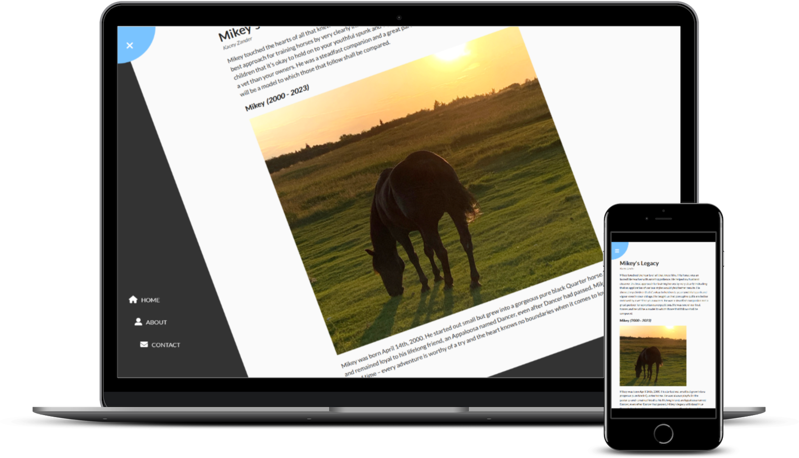

# Rotating Navigation Article

This is a modification to the [Rotating Navigation project in the Udemy course 50 Projects in 50 Days](https://www.udemy.com/course/50-projects-50-days/?src=sac&kw=50+projects+50+days).

## Project Details

### View My Project: 

## Features

- Hidden vertical navigation bar
- Article rotates to reveal the navigation options

## Technologies Used

- HTML
- CSS
- Javascript

## Acknowledgements

Project idea: Brad Traversy, Florin Pop [Udemy course 50 Projects in 50 Days](https://www.udemy.com/course/50-projects-50-days/?src=sac&kw=50+projects+50+days)

Original HTML, CSS & Javascript provided by: Brad Traversy, Florin Pop [Udemy course 50 Projects in 50 Days](https://www.udemy.com/course/50-projects-50-days/?src=sac&kw=50+projects+50+days)

